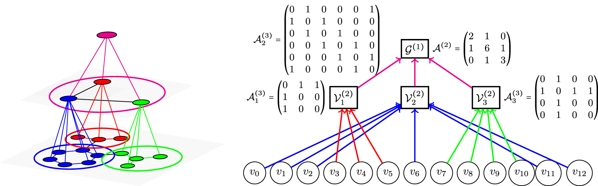

# Multiresolution Equivariant Graph Variational Autoencoder (MGVAE)



## Paper

Published at **Machine Learning: Science and Technology** journal:
https://iopscience.iop.org/article/10.1088/2632-2153/acc0d8

Presented at **ICML 2022** (AI for Science workshop):
https://arxiv.org/pdf/2106.00967.pdf

## Authors
Truong Son Hy and Risi Kondor

## Requirement
* Python 3.7.10
* PyTorch 1.8.0

Recommend using Conda environment for easy installation.

## Experiments
* ```supervised_learning_molecules```: Supervised learning of Multiresolution Graph Networks (MGN) for molecular properties prediction.
* ```citation_link_prediction```: Link prediction on citation graphs by MGVAE.
* ```general_graph_generation```: General graph generation by MGVAE.
* ```image_generation```: Graph-based image generation by MGVAE.
* ```unsupervised_molecules```: Unsupervised molecular representation learning by MGVAE.

For experiments on molecule generation, please visit our another repository: 
https://github.com/HySonLab/MGVAE

## To cite our work
```bibtex
@article{Hy_2023,
doi = {10.1088/2632-2153/acc0d8},
url = {https://dx.doi.org/10.1088/2632-2153/acc0d8},
year = {2023},
month = {mar},
publisher = {IOP Publishing},
volume = {4},
number = {1},
pages = {015031},
author = {Truong Son Hy and Risi Kondor},
title = {Multiresolution equivariant graph variational autoencoder},
journal = {Machine Learning: Science and Technology},
abstract = {In this paper, we propose Multiresolution Equivariant Graph Variational Autoencoders (MGVAE), the first hierarchical generative model to learn and generate graphs in a multiresolution and equivariant manner. At each resolution level, MGVAE employs higher order message passing to encode the graph while learning to partition it into mutually exclusive clusters and coarsening into a lower resolution that eventually creates a hierarchy of latent distributions. MGVAE then constructs a hierarchical generative model to variationally decode into a hierarchy of coarsened graphs. Importantly, our proposed framework is end-to-end permutation equivariant with respect to node ordering. MGVAE achieves competitive results with several generative tasks including general graph generation, molecular generation, unsupervised molecular representation learning to predict molecular properties, link prediction on citation graphs, and graph-based image generation. Our implementation is available at https://github.com/HyTruongSon/MGVAE.}
}
```
